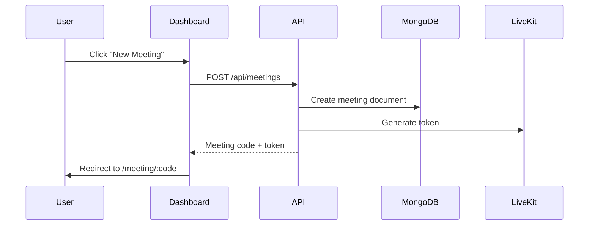
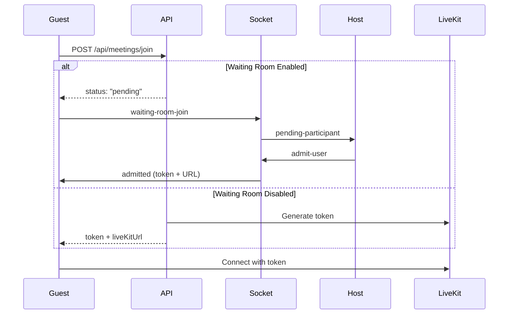
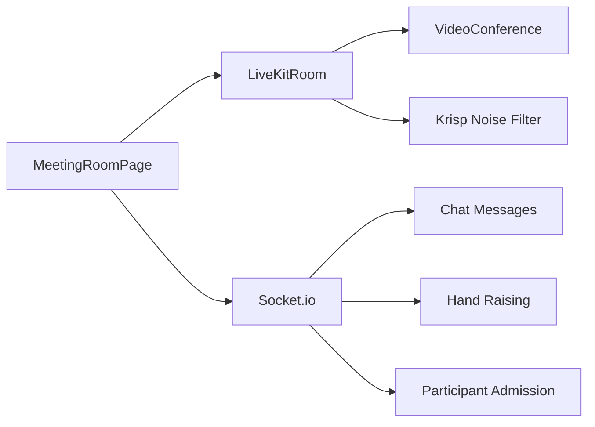

# Meet-io Meeting System Documentation

Complete documentation of the meeting system including creating, joining, and participating in meetings.

---

## 1. New Meeting Flow

### How It Works



### Key Files

| File | Purpose |
|------|---------|
| [NewMeetingCard.tsx](file:///d:/meet-io/client/src/components/dashboard/NewMeetingCard.tsx) | UI for creating instant meetings |
| [ScheduleMeetingCard.tsx](file:///d:/meet-io/client/src/components/dashboard/ScheduleMeetingCard.tsx) | UI for scheduling future meetings |
| [meetingController.ts#createMeeting](file:///d:/meet-io/server/src/controllers/meetingController.ts#L13-L189) | Backend logic for meeting creation |
| [Meeting.ts](file:///d:/meet-io/server/src/models/Meeting.ts) | Mongoose schema for meetings |

### Features
- ✅ Instant meeting creation
- ✅ Scheduled meetings with date/time
- ✅ Configurable waiting room
- ✅ Email invitations to attendees
- ✅ ICS calendar file generation
- ✅ Duplicate meeting prevention

---

## 2. Join Meeting Flow

### How It Works



### Key Files

| File | Purpose |
|------|---------|
| [JoinMeetingCard.tsx](file:///d:/meet-io/client/src/components/dashboard/JoinMeetingCard.tsx) | UI for entering meeting code |
| [meetingController.ts#joinMeeting](file:///d:/meet-io/server/src/controllers/meetingController.ts#L191-L348) | Join logic with waiting room check |
| [WaitingRoomScreen.tsx](file:///d:/meet-io/client/src/components/meeting/WaitingRoomScreen.tsx) | Waiting room UI for guests |
| [socketHandlers.ts](file:///d:/meet-io/server/src/socket/socketHandlers.ts) | Real-time admit/deny events |

### Features
- ✅ Join by meeting code
- ✅ Waiting room with host approval
- ✅ Real-time admission via WebSocket
- ✅ "Meeting not started" screen for scheduled meetings
- ✅ Automatic polling when waiting for host

---

## 3. Meeting Room

### How It Works

The meeting room uses **LiveKit** for WebRTC video/audio streaming and **Socket.io** for real-time chat and hand-raising.



### Key Files

| File | Purpose |
|------|---------|
| [MeetingRoomPage.tsx](file:///d:/meet-io/client/src/pages/MeetingRoomPage.tsx) | Main meeting room component |
| [socketHandlers.ts](file:///d:/meet-io/server/src/socket/socketHandlers.ts) | Chat, hand-raise, admit/deny |
| [livekit.ts](file:///d:/meet-io/server/src/utils/livekit.ts) | Token generation for LiveKit |

### Features
- ✅ HD Video/Audio via LiveKit
- ✅ Screen sharing
- ✅ Krisp noise cancellation (optional)
- ✅ Real-time chat
- ✅ Hand raising
- ✅ Host controls (admit/deny from waiting room)
- ✅ Copy meeting link

---

## 4. Suggested Improvements

### 🔴 High Priority

| Feature | Description | Complexity |
|---------|-------------|------------|
| **Recording** | Allow hosts to record meetings to cloud storage | High |
| **Breakout Rooms** | Split participants into smaller groups | High |
| **Virtual Backgrounds** | Replace background with images/blur | Medium |

### 🟡 Medium Priority

| Feature | Description | Complexity |
|---------|-------------|------------|
| **Polls/Voting** | Host can create live polls during meeting | Medium |
| **Reactions** | Emoji reactions (👍 ❤️ 😂) floating on screen | Low |
| **Whiteboard** | Collaborative drawing canvas | High |
| **Transcript** | Live speech-to-text captions | Medium |

### 🟢 Low Priority (Nice to Have)

| Feature | Description | Complexity |
|---------|-------------|------------|
| **Meeting Templates** | Save recurring meeting settings | Low |
| **Analytics Dashboard** | Meeting duration, attendance stats | Medium |
| **Custom Branding** | Logo/colors for enterprise users | Low |
| **Mobile App** | React Native companion app | High |

---

## 5. Environment Variables Required

### Server (`server/.env`)
```
LIVEKIT_URL=wss://meet-io-wd7xbiqz.livekit.cloud
LIVEKIT_API_KEY=API7uMv4MutcuR8
LIVEKIT_API_SECRET=ntifk7cewbXFRzvnLIJHVhGrL1M1eYSfAF2nWadCrSMC
```

### Client (`client/.env`)
```
VITE_API_URL=http://localhost:5000/api
VITE_LIVEKIT_URL=wss://meet-io-wd7xbiqz.livekit.cloud
```

---

## 6. Testing Checklist

- [ ] Create instant meeting → redirects to room
- [ ] Schedule meeting for future → shows in dashboard
- [ ] Join with code (waiting room ON) → shows waiting screen
- [ ] Host admits guest → guest enters meeting
- [ ] Host denies guest → guest redirected to dashboard
- [ ] Join with code (waiting room OFF) → enters directly
- [ ] Chat messages appear for all participants
- [ ] Hand raise shows indicator for host
- [ ] Screen share works
- [ ] Noise filter toggle works
