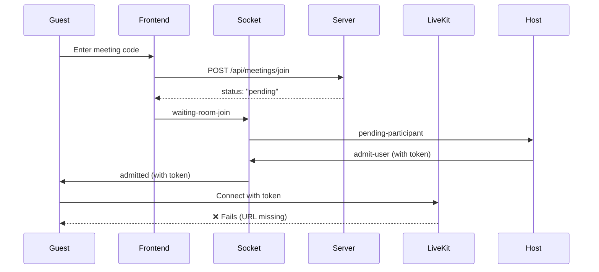

# Meeting System Analysis Report

## Issue Reported
> User joins meeting → Host approves → **"Disconnected" toast appears** → User cannot enter meeting

---

## System Architecture



---

## Root Cause: Missing LiveKit URL

When admitted via socket, the guest receives a **token** but the **LiveKit URL** is not set.

| Code Location | Issue |
|--------------|-------|
| [MeetingRoomPage.tsx:232](file:///d:/meet-io/client/src/pages/MeetingRoomPage.tsx#L232) | `liveKitUrl` initialized from `import.meta.env.VITE_LIVEKIT_URL` which may be empty |
| [MeetingRoomPage.tsx:245-248](file:///d:/meet-io/client/src/pages/MeetingRoomPage.tsx#L245-248) | `handleAdmitted` only sets token, doesn't set URL |
| [socketHandlers.ts:70-76](file:///d:/meet-io/server/src/socket/socketHandlers.ts#L70-L76) | Socket `admit-user` only sends token, not URL |

---

## Fix Required

### 1. Socket should send LiveKit URL with token

```diff
// server/src/socket/socketHandlers.ts
socket.on('admit-user', (data: AdmitUserData) => {
-   io.to(targetSocketId).emit('admitted', { roomId, token });
+   io.to(targetSocketId).emit('admitted', { 
+       roomId, 
+       token,
+       liveKitUrl: process.env.LIVEKIT_URL 
+   });
});
```

### 2. Client should use URL from socket event

```diff
// client/src/pages/MeetingRoomPage.tsx
-const handleAdmitted = useCallback((newToken: string) => {
+const handleAdmitted = useCallback((newToken: string, url?: string) => {
    setIsPending(false);
    setToken(newToken);
+   if (url) setLiveKitUrl(url);
    toast.success('You have been admitted!');
}, []);
```

### 3. WaitingRoomScreen should pass URL

```diff
// client/src/components/meeting/WaitingRoomScreen.tsx
-const handleAdmitted = (data: { token: string }) => {
+const handleAdmitted = (data: { token: string; liveKitUrl?: string }) => {
-   onAdmitted(data.token);
+   onAdmitted(data.token, data.liveKitUrl);
};
```

---

## Other Files to Check

| File | Purpose |
|------|---------|
| [meetingController.ts](file:///d:/meet-io/server/src/controllers/meetingController.ts) | Creates meetings, generates tokens |
| [socketHandlers.ts](file:///d:/meet-io/server/src/socket/socketHandlers.ts) | Real-time admit/deny events |
| [WaitingRoomScreen.tsx](file:///d:/meet-io/client/src/components/meeting/WaitingRoomScreen.tsx) | Waiting UI for guests |
| [MeetingRoomPage.tsx](file:///d:/meet-io/client/src/pages/MeetingRoomPage.tsx) | Main meeting room component |

---

## Environment Check

Ensure these are set in `server/.env`:
```
LIVEKIT_URL=wss://meet-io-wd7xbiqz.livekit.cloud
LIVEKIT_API_KEY=API7uMv4MutcuR8
LIVEKIT_API_SECRET=ntifk7cewbXFRzvnLIJHVhGrL1M1eYSfAF2nWadCrSMC
```

And in `client/.env` (or `.env.local`):
```
VITE_LIVEKIT_URL=wss://meet-io-wd7xbiqz.livekit.cloud
```
