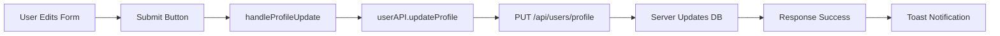
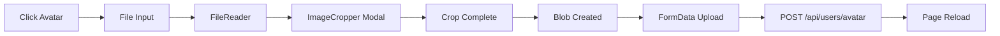
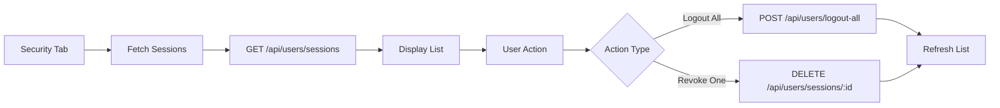

# User Profile System - Comprehensive Documentation

## Overview

The Meet-io user profile system provides a complete solution for users to manage their personal information, security settings, and account preferences. The system features a modern, dark-themed UI with avatar management, profile editing, password changes, session management,and account deletion.

---

## System Architecture

### Client-Side
- **Location:** [`client/src/pages/ProfilePage.tsx`](file:///d:/meet-io/client/src/pages/ProfilePage.tsx)
- **Framework:** React with TypeScript
- **State Management:** React Hooks (useState, useEffect, useRef)
- **Authentication Context:** `useAuth()` hook
- **UI Library:** Lucide React icons, React Hot Toast

### Server-Side
- **Location:** [`server/src/controllers/userController.ts`](file:///d:/meet-io/server/src/controllers/userController.ts)
- **Database:** MongoDB with Mongoose
- **Authentication:** JWT-based with session management
- **File Upload:** Multipart form data for avatars

---

## Features

### 1. Profile Overview

#### Personal Information
**Fields:**
- **Full Name** (text input)
- **Job Title** (optional text input)
- **Bio** (textarea, 4 rows)
- **Email** (read-only, displayed as badge)
- **Role** (read-only badge - "USER" or "ADMIN")

**UI Components:**
```tsx
// Left Column
- Avatar display (circular, 132x132px)
- Hover overlay with camera icon
- File upload trigger
- Name, email, role badges

// Right Column  
- Tabbed interface (Overview | Security)
- Form with name, title, bio fields
- Save Changes button with loading state
```

**API Integration:**
```tsx
// Update Profile
PUT /api/users/profile
Body: { name, title, bio }
Response: { success, message, user }
```

### 2. Avatar Management

**Features:**
- Click-to-upload avatar
- Image cropping modal
- Real-time preview
- Circular crop enforced

**Flow:**
1. User clicks avatar → file input triggered
2. User selects image → `FileReader` loads image
3. Image displayed in cropper modal
4. User crops image → blob generated
5. Blob uploaded via API → page reloads

**Components:**
- [`ImageCropper.tsx`](file:///d:/meet-io/client/src/components/profile/ImageCropper.tsx) - Cropping modal
- `fileInputRef` - Hidden file input

**API Integration:**
```tsx
// Upload Avatar
POST /api/users/avatar
Content-Type: multipart/form-data
Body: FormData with 'avatar' field
Response: { success, avatar: url }
```

**Default Avatar:**
```tsx
https://api.dicebear.com/7.x/avataaars/svg?seed=Felix
```

### 3. Security Tab

#### Password Management
**Features:**
- Change password form
- Current password verification
- New password + confirmation
- Password mismatch validation

**UI:**
```tsx
- Current Password input
- New Password input
- Confirm New Password input
- Update Password button
```

**API Integration:**
```tsx
// Update Password
PUT /api/users/password  
Body: { currentPassword, newPassword }
Response: { success, message }
```

**Validation:**
```tsx
if (newPassword !== confirmPassword) {
    toast.error("New passwords don't match");
    return;
}
```

#### Session Management
**Features:**
- View all active sessions
- Display current session with badge
- Logout from current device
- Logout from all other devices
- Revoke individual sessions

**Session Display:**
```tsx
{
  userAgent: "Chrome 120 / Windows 10",
  lastActive: "2024-12-15T00:00:00.000Z",
  current: boolean,
  _id: "session-id"
}
```

**UI Components:**
- Session list with device icons
- Current session badge (green)
- Hover-to-reveal revoke button
- Bulk actions (logout all)

**API Integration:**
```tsx
// Get Sessions
GET /api/users/sessions
Response: { success, sessions: [] }

// Logout All
POST /api/users/logout-all
Response: { success, message }

// Revoke Session
DELETE /api/users/sessions/:sessionId
Response: { success, message }
```

#### Account Deletion (Danger Zone)
**Features:**
- Red-themed danger zone section
- Confirmation input (must type "DELETE")
- Double confirmation dialog
- Irreversible warning

**UI:**
```tsx
// Danger Zone Card
- Red border and background (red-500/5)
- Warning text
- Confirmation input
- Delete button (disabled until confirmed)
```

**Flow:**
1. User types "DELETE" in input
2. Button becomes enabled
3. User clicks "Delete Account"
4. Confirmation dialog appears
5. If confirmed → API call
6. Account deleted → redirect to login

**API Integration:**
```tsx
// Delete Account
DELETE /api/users/account
Response: { success, message }
```

---

## Data Flow

### Profile Update Flow


### Avatar Upload Flow


### Session Management Flow


---

## API Endpoints Summary

| Method | Endpoint | Purpose | Auth Required |
|--------|----------|---------|---------------|
| PUT | `/api/users/profile` | Update name, title, bio | ✅ Yes |
| POST | `/api/users/avatar` | Upload avatar image | ✅ Yes |
| PUT | `/api/users/password` | Change password | ✅ Yes |
| GET | `/api/users/sessions` | Get active sessions | ✅ Yes |
| POST | `/api/users/logout-all` | Logout all devices | ✅ Yes |
| DELETE | `/api/users/sessions/:id` | Revoke specific session | ✅ Yes |
| DELETE | `/api/users/account` | Delete account | ✅ Yes |

---

## User Interface

### Layout Structure
```tsx
ProfilePage
├── Sidebar (left navigation)
└── Main Content
    ├── Header (title, description)
    └── Grid Layout (lg:grid-cols-3)
        ├── Left Column (Avatar & Info Card)
        │   ├── Avatar (hover to upload)
        │   ├── Name
        │   ├── Email
        │   └── Role Badge
        └── Right Column (Tabs)
            ├── Tab Navigation
            ├── Overview Tab
            │   └── Personal Info Form
            └── Security Tab
                ├── Change Password
                ├── Active Sessions
                └── Danger Zone
```

### Color Scheme
```css
Background: #0B0E14
Cards: #1a1f2e/50 (with backdrop blur)
Borders: white/5
Text Primary: white
Text Secondary: gray-400
Primary Blue: #3b82f6
Success Green: #10b981
Danger Red: #ef4444
```

### Responsive Design
- **Mobile:** Single column layout
- **Tablet:** 2-column grid on larger screens
- **Desktop:** 3-column grid (lg breakpoint)
- Sidebar hidden on mobile with hamburger menu

---

## State Management

### Local State (ProfilePage.tsx)
```tsx
// Tabs
activeTab: 'overview' | 'security'

// Profile
name: string
title: string
bio: string
isLoading: boolean

// Avatar
avatarSrc: string | null
showCropper: boolean
fileInputRef: React.RefObject<HTMLInputElement>

// Security
sessions: any[]
currentPassword: string
newPassword: string
confirmPassword: string
deleteConfirm: string
```

### Global State (AuthContext)
```tsx
user: {
  _id: string
  name: string
  email: string
  avatar: string
  role: 'user' | 'admin'
  title?: string
  bio?: string
}
logout: () => void
```

---

## Key Features Explained

### 1. Auto-Refresh on Avatar Upload
**Why:** Context doesn't automatically update after avatar upload

```tsx
if (data.success) {
    toast.success('Avatar updated!');
    window.location.reload(); // Force refresh
}
```

**Better Approach:** Update context manually:
```tsx
// In AuthContext
const updateUser = (updates: Partial<User>) => {
    setUser(prev => ({ ...prev, ...updates }));
};

// In ProfilePage
updateUser({ avatar: data.avatar });
```

### 2. Session Auto-Refresh
Sessions are re-fetched:
- When Security tab is opened
- After logging out all devices
- After revoking a session
- Every 30 seconds (not currently implemented, but recommended)

### 3. Form Validation
**Profile:**
- Name is required (validated server-side)
- Title and bio are optional

**Password:**
- Current password required
- New password must match confirmation
- Server validates current password
- Server enforces password strength (if implemented)

**Account Deletion:**
- Must type "DELETE" exactly
- Double confirmation dialog
- Irreversible action warning

### 4. Animations
```tsx
// Tab switching animation
className="animate-in fade-in slide-in-from-bottom-4 duration-300"

// Loading spinner
className="animate-spin rounded-full h-8 w-8 border-2 border-blue-500 border-t-transparent"

// Hover effects
className="opacity-0 group-hover:opacity-100 transition-opacity"
```

---

## Security Considerations

### 1. Authentication
- All endpoints require JWT authentication
- Middleware validates user before allowing access
- Sessions tracked for logout functionality

### 2. Password Security
- Current password required to change password
- Password strength validation (recommended to add)
- Passwords never exposed in responses
- bcrypt hashing on server

### 3. File Upload Security
- Avatar upload validates file type
- File size limits should be enforced
- Stored securely (cloud storage or file system)
- Sanitized filenames

### 4. Account Deletion
- Double confirmation required
- All user data should be deleted (GDPR compliance)
- Sessions invalidated immediately
- Irreversible action

---

## Improvements & Recommendations

### 1. Context Updates
Instead of `window.location.reload()` after avatar upload:
```tsx
// Add to AuthContext
const updateUser = (updates: Partial<User>) => {
    setUser(prev => prev ? { ...prev, ...updates } : null);
};

// Use in ProfilePage
handleCropComplete = async (blob) => {
    const data = await upload(blob);
    updateUser({ avatar: data.avatar });
    toast.success('Avatar updated!');
};
```

### 2. Password Strength Indicator
```tsx
<div className="mt-2">
    <div className="h-1 bg-gray-700 rounded-full overflow-hidden">
        <div 
            className={`h-full transition-all ${getStrengthColor()}`}
            style={{ width: `${passwordStrength}%` }}
        />
    </div>
    <p className="text-xs text-gray-400 mt-1">
        {getStrengthText()}
    </p>
</div>
```

### 3. Email Verification
Add option to change email with verification:
```tsx
- Send verification code to new email
- User enters code
- Email updated after verification
```

### 4. Two-Factor Authentication
```tsx
// Add to Security tab
- Enable/Disable 2FA
- QR code generation
- Backup codes display
```

### 5. Activity Log
```tsx
// Show recent account activity
- Login attempts
- Profile changes
- Password changes
- Session activity
```

### 6. Session Details
Enhance session display:
```tsx
{
  device: "iPhone 13",
  browser: "Safari 17",
  location: "New York, US",
  ipAddress: "192.168.1.1",
  lastActive: Date,
  current: boolean
}
```

---

## File Structure

```
client/src/
├── pages/
│   └── ProfilePage.tsx          # Main profile page
├── components/
│   └── profile/
│       └── ImageCropper.tsx     # Avatar cropper modal
├── context/
│   └── AuthContext.tsx          # User authentication context
└── services/
    └── api.ts                   # API service (userAPI methods)

server/src/
├── controllers/
│   └── userController.ts        # Profile API endpoints
├── models/
│   └── User.ts                  # User model schema
└── routes/
    └── userRoutes.ts            # User routes
```

---

## Testing Checklist

### Profile Update
- [ ] Update name
- [ ] Update title
- [ ] Update bio
- [ ] Save with empty optional fields
- [ ] Verify toast notification
- [ ] Verify UI reflects changes

### Avatar Upload
- [ ] Upload valid image (JPG, PNG)
- [ ] Crop and save
- [ ] Verify upload success
- [ ] Check avatar displays correctly
- [ ] Test with large file (should handle)

### Password Change
- [ ] Change password with valid inputs
- [ ] Try with wrong current password
- [ ] Try with mismatched new passwords
- [ ] Verify can login with new password

### Session Management
- [ ] View active sessions
- [ ] Logout from current device
- [ ] Logout from all other devices
- [ ] Revoke specific session
- [ ] Verify UI updates after actions

### Account Deletion
- [ ] Try without typing "DELETE" (should be disabled)
- [ ] Type "DELETE" and confirm
- [ ] Cancel confirmation
- [ ] Complete deletion
- [ ] Verify redirect to login
- [ ] Verify account is removed from database

---

## Summary

The Meet-io user profile system is a comprehensive, production-ready solution featuring:

✅ **Modern UI** - Dark theme, responsive design, smooth animations  
✅ **Complete Features** - Profile editing, avatar upload, security controls  
✅ **Security** - Password change, session management, account deletion  
✅ **Good UX** - Toast notifications, loading states, confirmations  
✅ **Type Safety** - Full TypeScript implementation  
✅ **Scalable** - Modular components, clean architecture  

**Areas for Enhancement:**
- Add Context updates instead of page reload
- Implement password strength indicator
- Add email change functionality
- Implement 2FA
- Add activity log
- Enhance session details
